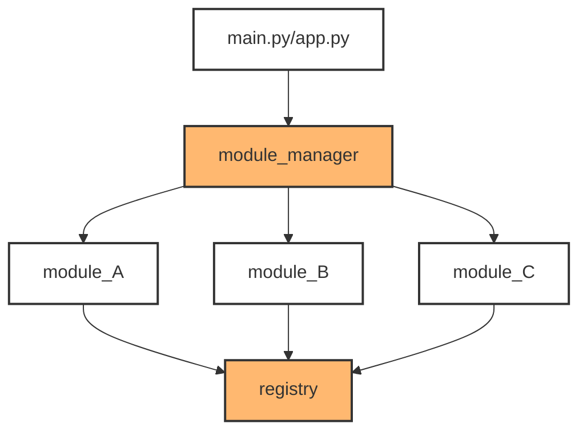

# EZ Module Manager
An **_event-driven_** way to decouple your imports and function calls.  

Simple, modular, and powerful. Truly Plug-n-Play.

You can probably finish reading this with your coffee and understand 
everything about it.

This `Module Manager` is pretty basic to use. It sits between the main 
application entry point(main.py, app.py, etc) and the rest of the program's 
modules. The `registry` component of this `Module Manager` sits seemingly 
isolated at the end, however, it is in my opinion the most powerful feature 
of this extremely basic system. This system is as bare bones as it gets; 
zero bloat. No additional imports are needed other than the basic imports 
explained in this documentation. Other than the awesome functionality you get from 
this package, you wont even notice it in your way.


I'll let it be known that this is my first package. This `Module Manager` 
is highly inspired by a system I built inside Unreal Engine 5 for 
registering backend factory components. This system works in the same 
way as that Unreal Engine system; there's a main `registry` component that 
holds references to all shared function objects. When a function lives 
in `module_A.py` and you call it from `module_B.py`, it's as easy as 
calling the exact function name that lives in `module_A.py`. This is the 
'magic' of it. `module_A.py` and `module_B.py` don't know about eachother 
but can call eachothers functions. You can also pass and return variables. 
Sweet.

To get a mental model before we start, it looks/works like this :



---
## 1. Registering Modules

> [!IMPORTANT]
> The `Module Manager` is initialized by your main application 
> (main.py, app.py, etc) using the [import_modlist()](#import_modlist) function. 
> Basically wherever your apps main entry point is.


For a quick technical overview, the `module_manager` passes the module 
names into [**import_module()**](https://docs.python.org/3/library/importlib.html#importlib.import_module) 
from the [**importlib**](https://docs.python.org/3/library/importlib.html) 
built-in library.
[**import_module()**](https://docs.python.org/3/library/importlib.html#importlib.import_module) 
loads each module sequentially so every function gets *'registered'* 
before they ever have a chance of being executed.

Let's say we have 3 modules. We'll call 2 of these modules that we want 
to export functions from, `module_A.py` and `module_B.py`. Our 3rd module 
which we **dont** want to export functions from, but simply use functions 
from `module_A.py` and `module_B.py`, we'll call... you guessed it, 
`module_C.py`. All 3 module names get input into the `modlist`, in 
quotes, without the `.py` suffix and passed into 
[import_modlist()](#import_modlist) as a *list*. I will show you exactly how 
to do this.


There are 2 ways to gain access to [import_modlist()](#import_modlist), of 
which are syntactically different ways of importing packages and 
functions in python. There are slight pros and cons to both import 
methods, and you will be shown both methods. Information about pros/cons
can be found under 
[**Modules**](https://docs.python.org/3/tutorial/modules.html#modules) 
in the python docs.

#### Method 1 - Import the `module_manager` module :
 ```python
# main.py / app.py / etc

from ezmodmanager import module_manager

...

...
# Initialize a list of module names without `.py, etc..` suffix.
modlist = ['module_A', 'module_B', 'module_C']
 
# Pass module names to the `module_manager`.
module_manager.import_modlist(modlist)
 ```
#### Method 2 - Import [import_modlist()](#import_modlist) explicitly :
```python
# main.py / app.py / etc

from ezmodmanager.module_manager import import_modlist

...

...

modlist = ['module_A', 'module_B', 'module_C']

import_modlist(modlist)
```
#### Preferred Method - Skip the modlist assignment altogether :
```python
# main.py / app.py / etc

from ezmodmanager import module_manager
...

...

# Skip variable assignment and add your list as a direct argument.
# Preferred list format. 
module_manager.import_modlist([
    'module_A',
    'module_B',
    'module_C'
])
```

You might notice how these module names align with the diagram above. 
That's because that's exactly what's happening here. 
[import_modlist()](#import_modlist) is injecting your list of modules into the
`module_manager`, so it can import your modules one at a time in an
event-driven manner. 

### Django, Flask, FastAPI, etc...
Just make sure that you call [import_modlist()](#import_modlist) before your routes fire up.
It needs to be initialized before your app actually starts functioning. 
Otherwise, functions get called, functions aren't registered, no keys, 
no values, no fun.

---
## 2. Registering Functions

Now that the `module_manager` has the names of your modules 
(`module_A`, `module_B`, `module_C`), you need to register the functions 
from `module_A` and `module_B` with the `registry` using 
[register_func()](#register_func). It's easier than it sounds.

You need to explicitly import the `registry`. You also need 
to call [register_func()](#register_func) from the `registry` to now
*'register'* these shared functions.

To do this, we can follow the example for `module_A` :

```python
# module_A.py

from ezmodmanager.registry import register_func
...

...
# Define your functions.
def lancelot() -> None:
    print('I am Sir Lancelot!')
    return None

def knights_of_ni(offering: str, requirement: str) -> bool:
    if offering == requirement:
        print(f'The {offering} is accepted as an offering.')
        return True
    print(f'The {offering} is not accepted as an offering.')
    return False
...

...
# Register your functions.
register_func(lancelot, knights_of_ni)
```
Apply the same concept to `module_B`.  

`module_C` will be dealt with in the next section, [Calling Functions](#3-calling-functions).  

Now, also make sure that [register_func()](#register_func) is called **below** all of 
your defined shared functions like the above example, otherwise, you're 
passing `None` type values because [register_func()](#register_func) wont know your 
defined functions exist.

> [!WARNING] 
> When adding functions as arguments to [register_func()](#register_func),
> **do not** add the parenthesis, as this calls the function. By omitting
> the parenthesis, we are storing the function object's memory address,
> which we can use later. 

:white_check_mark: This is good :
```python
register_func(lancelot, knights_of_ni)
```
:x: This is bad :
```python
register_func(lancelot(), nights_of_ni())
```
---
## 3. Calling Functions
This is where the versatility comes into play. You have complete access 
to these functions without any circular dependencies occuring. I will 
show you multiple ways to use this functionality.

We can now use `module_C` to gain access to **`lancelot()`** and 
**`nights_of_ni()`** from `module_A`. You can use this same exact 
syntax inside `module_B` to gain access as well. If `module_B` had
functions you wanted to share, you could gain access from any 
other module as well. You can see where this is going. Lets
move on.

> [!IMPORTANT]
> This `registry` component takes advantage of nested dictionaries. 
> Therefore [call_func()](#call_func), takes 2 main positional arguments: the containing
> modules namespace, and the function name itself.

### Storing the function for later use

<sub>Parameterless Function Call - returns `Any`</sub>

```python
# module_C.py

from ezmodmanager.registry import call_func
...

# Store `lancelot()` from `module_A`.
lancelot = call_func('module_A', 'Lancelot')


# Call the function.
lancelot()

# Result
> I am Sir Lancelot!


or


# Call the function and print the return value.
print(lancelot())

# Result
> I am Sir Lancelot!
> None 
```

<sub>Parameterized Function Call - returns `Any`</sub>

```python
# module_C.py

from ezmodmanager.registry import call_func
...

# Store `nights_of_ni()` from `module_A`.
nights_of_ni = call_func('module_A', 'nights_of_ni')


# Call the function with required arguments.
nights_of_ni('holy hand grenade', 'shrubbery')

# Result
> The holy hand grenade is not accepted as an offering.


or


# Call the function with required arguments
# and print the return value.
print(nights_of_ni('shrubbery', 'shrubbery'))

# Result
> The shrubbery is accepted as an offering.
> True
```


### Calling the function directly

<sub>Parameterless Function Call - returns `Any`</sub>

```python
# module_C.py

from registry import call_func
...

# The 'call=True' argument tells the registry to call the function 
# and return a possible value, instead of returning the function object.
call_func('module_A', 'lancelot', call=True)

# Result
> I am Sir Lancelot!


or


# Call the function and print the return value.
print(call_func('module_A', 'lancelot', call=True))

# Result
> I am Sir Lancelot
> None
```

<sub>Parameterized Function Call - returns `Any`</sub>

```python
# module_C.py

from registry import call_func
...

# call=True is not used here. When passing arguments, it is assumed that 
# you want to call the function.
call_func('module_A', 'nights_of_ni', 'holy hand grenade', 'shrubbery')

# Result
> The holy hand grenade is not accepted as an offering.


or


# Call the function with required arguments
# and print the return value.
print(call_func('module_A', 'nights_of_ni', 'shrubbery', 'shrubbery'))

# Result
> The shrubbery is accepted as an offering.
> True
```

It's that easy.


---
## Function Cheat Sheet

### import_modlist()
```python
def import_modlist(modlist: Sequence[str]) -> None:
    """Import modules sequentially.

    :param modlist: A tuple of module names to register with the
        :attr:`_REGISTRY`. Each module name is entered as an 
        argument omitting the `.py` suffix.
        This includes two types of modules:

        - Modules that want to store functions with :attr:`_REGISTRY`.
        - Modules that want to use functions stored with :attr:`_REGISTRY`.

    :raises MissingModuleError: If a module in `modlist` cannot be found.
    """
```
### register_func()
```python
def register_func(*args: Callable) -> None:
    """Store a function in the `_Registry`.
    
    `register_func` automatically stores the containing modules namespace
    as a key for the outermost `dict` object. It then stores the 
    function name as a key for the innermost `dict` object. Last but not
    least, it stores the actual memory address of the function as the value
    for that innermost `dict`. You can then use that memory address to 
    call on that function. 

    :param *args: The function object `Callable` to store in the `_REGISTRY`.

    :raises: FunctionRegistrationError: Raised if `register_func()' is
        NOT passing a valid function object. Usually when a function 
        registration attempt is done with a str literal.
    """
```
### call_func()
```python
def call_func(
    module_name: str,
    func_name: str,
    *args: Any,
    call: bool = False
) -> Callable[..., Any] | Any:
    """Calls a function that has been stored in the `_REGISTRY`.

    :param module_name: The module namespace whose functions you 
        want access to. 
    :param func_name: The name of the function within the `module_name`
        to access.
    :param *args: Variable positional arguments passed to the registered 
        function. If provided, the function is executed immediately.
    :param call: Defaults to False. If True; executes the registered 
        parameterless function. If you accidentally use `call=True` on 
        a parameterized function, you won't hurt anything. `call=True` 
        is set automatically when passing arguments.
    
    :returns: Returns the function object `Callable` if no arguments were 
        provided and `call=False`(default).
    :returns: Returns `Any` if the function was executed (either via 
        `*args` being present or `call=True`).

    :raises: RegistryKeyError: Raised if `func_name` does not exist in the 
        `_REGISTRY`.
    """
```

