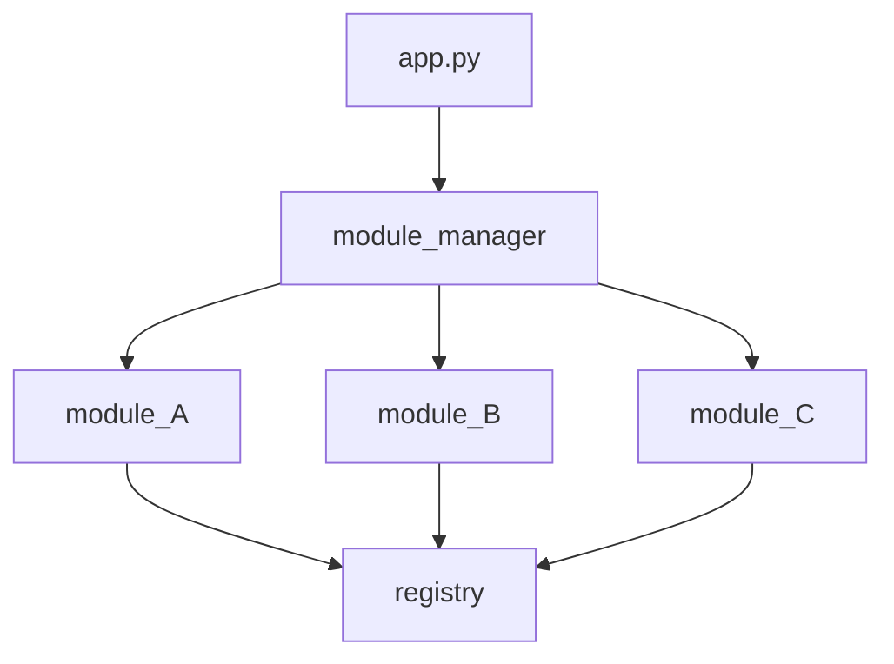

# EZini Module Manager
A way to decouple your imports and function calls.  

Simple, modular, powerful, and easily configurable.  

This is one of those documents you can finish reading with your coffee and understand everything about it.


This ```module_manager``` is pretty basic to use. It sits between the main application module(app.py, \_\_init\_\_.py,  etc) and the rest of the programs' modules. The ```registry``` component of this ```module_manager``` sits seemingly isolated at the end, however, it is in my opinion the most powerful feature of this extremely basic system.

I'll let it be known that this is my first uploaded package. This ```module_manager``` is highly inspired by a system I built inside Unreal Engine 5 for registering backend factory components. This system works in the same way as that Unreal Engine system; there's a main ```registry``` module that holds references to all shared function objects. When a function lives in ```module_A``` and you call it from ```module_B```, it's as easy as calling the exact function name that lives in ```module_A```. This is the 'magic' of it. ```module_A``` and ```module_B``` don't know about eachother but can call eachothers functions. Sweet.

To get a mental model before we start, it looks/works like this:




## Module Manager

>**The ```module_manager``` is initialized by your main application ( app.py, \_\_init\_\_.py, etc ). Basically wherever your apps main entry point is.**

If you want a function from a module, that module's name goes in the ```modlist```, in quotes, without the extension(.py).  

Let's say I have 3 modules I want to import functions from: module_A.py, module_B.py, and module_C.py 

There are 2 ways to gain access to the ```module_manager modlist```

```python
# app.py

from module_manager import module_import
...

...
modlist = ['module_A', 'module_B', 'module_C']
import_modlist(modlist)
```
or
 ```python
# app.y

import module_manager
...

...
modlist = ['module_A', 'module_B', 'module_C']
module_manager.import_modlist(modlist)
 ```

You might notice how these module names align with the diagram above. That's because that's exactly what's happening here. 
```import_modlist()``` is injecting your list of modules into the module_manager, so it can import your modules one at a time
in an event-driven manner. I know, it's been tough so far. There isn't much left. Next is the fun part, assigning functions to variables


## Adding Your Modules

// any additional modules to add to the registry

I

When initializing any additional modules' functions, only
a couple of steps are required.

First, we need to import the registry's functions:

```python
import registry
``` 
or
```python
from registry import register_func, call_func
```


## Registry

Text here


